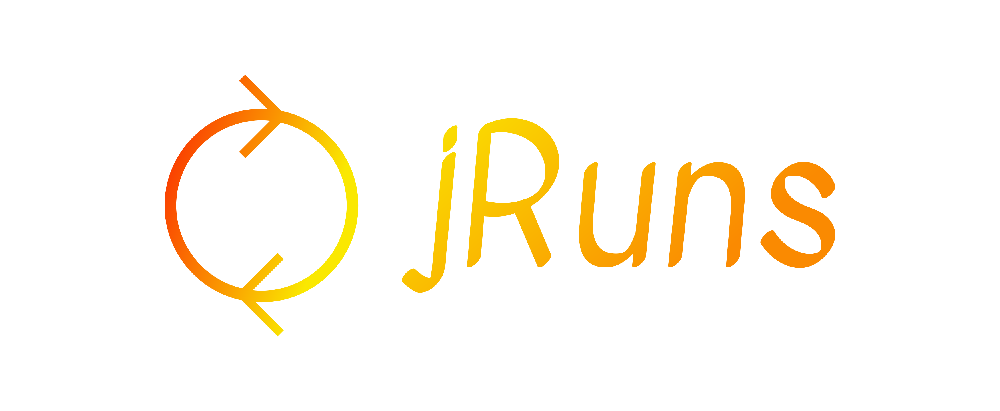

# logo
Concept of logo

## Font

        Font in use <a target="_blank" href="https://fonts.google.com/specimen/Kavivanar">Kavivanar-Regular</a> designed by
        <a target="_blank" href="http://thariqueazeez.com/">Tharique Azeez</a>
        and licensed under
        <a target="_blank" href="http://scripts.sil.org/cms/scripts/page.php?site_id=nrsi&amp;id=OFL_web">Open Font License.</a>
          Icon Designed by
          <a target="_blank" href="https://thenounproject.com/emilegraphics">emilegraphics</a>
          
## Colors

### icon
  
  + red, #FA1C01
  + yellow, #FAE801

### background

  + white
  + #ffffff
  
### font
  
  + yellow, #FAE801
  + red,  #FA8A01
  
### css 
    p {
       font-family: 'HKGroteskRegular';
       font-weight: normal;
       font-style: normal;
    }

### html

    <link rel="stylesheet" media="screen" href="https://fontlibrary.org/face/hk-grotesk" type="text/css"/>
    
    
# Logo

## 1

## 2

